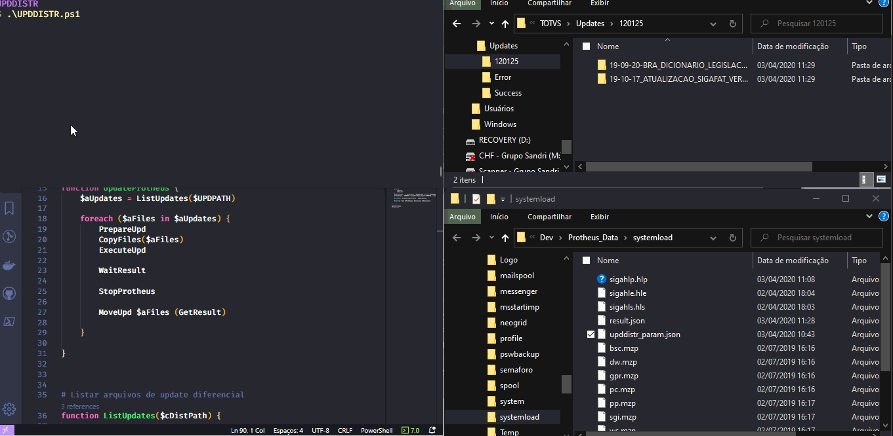

# ProtheusAutoUPD

Scripts em PowerShell para automatizar aplicação de Patches e execução de UPDDISTR no Protheus

- [Aplicador de Patches](#Patches/ApplyPatches.ps1)
- [Execução de UPDDISTR](#UPDDISTR/UPDDISTR.ps1)

# Patches/ApplyPatches.ps1

Script que compila no ambiente todos os Patches de determinado diretório

# UPDDISTR/UPDDISTR.ps1

Ferramenta para Execução automática do UPDDISTR
Utilizando https://tdn.totvs.com/display/public/PROT/UPDDISTR+executado+via+Job

### Configuração:
- Configurar um Appserver específico para a rotina, adcicionando no ini as linhas:
    [UPDJOB]
    MAIN=UPDDISTR
    ENVIRONMENT=P12

    [ONSTART]
    Jobs=UPDJOB
    RefreshRate=900

- Configurar os diretórios nas variáveis abaixo

### A ordem de execução é a seguinte:

- Lista os arquivos sdfbra e hlpdfpor nos subdiretórios
- Para cada conjunto de arquivos encontrado executa:
    - Prepara o ambiente (conforme documentação disponível em https://tdn.totvs.com/display/public/PROT/Upgrade+de+Release+do+Protheus+12)
    - Copia os arquivos sdfbra e hlpdfpor para a pasta SystemLoad
    - Executa o Appserver em modo console (deve estar com OnStart do UPDDISTR)
    - Aguarda o final da execução (result.json)
    - Move o diretório para Success ou Error, conforme resultado da execução
    - Apaga os arquivos temporários

# TODO:

## Erros
- [ ] Duas atualizações dentro do mesmo pacote
- [ ] Help e Dicionários em diretórios separados

## Melhorias
- [ ] Guardar logs na aplicação de patches
- [ ] Permitir parar o processo de UPDDISTR quando não executar
- [ ] Verificarse o OnStart está configurado no Ini do Protheus

# Autor

- [**Thiago G. Mota**](https://github.com/tgmti)

- **Aceitando contribuições**

# Licença
This project is licensed under the MIT License - see the LICENSE.md file for details